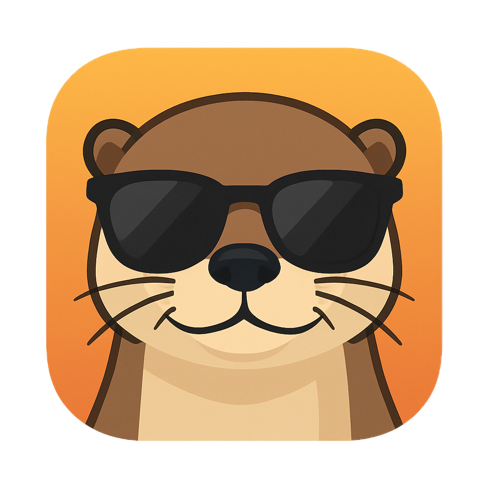

# HangOut
<table>
  <tr>
    <td>
      

        <strong>About Project</strong>  
        Building a native, private, cross-platform calendar coordination app tailored for friend groups and young adults who want to spend time together — but struggle to find common free days.  
        With a minimal design, privacy-first logic, and future support for iCal imports, HangOut is being developed for iOS and Android using React Native and Expo.
      

    </td>
    <td align="right">
      
    </td>
  </tr>
</table>

---
## 📊 Architecture & UI/X

### ✍️ Architecture Design Plan:

[HangOut-ArchitecturePlan-v1.docx](https://github.com/user-attachments/files/21382845/HangOut-ArchitecturePlan-v1.docx)

### 🖼️ UI/UX Design Drafts:

* [Draft 1 – meetME UI.pdf](https://github.com/user-attachments/files/21382872/meetME.UI.pdf)
* [Draft 2 – meetME UI-2.pdf](https://github.com/user-attachments/files/21382874/meetME.UI-2.pdf)
* [Draft 3 – meetME UI-3.pdf](https://github.com/user-attachments/files/21382885/meetME.UI-3.pdf)
* [Draft 4 – meetME UI-4.pdf](https://github.com/user-attachments/files/21382858/meetME.UI-4.pdf)

---

## 🌟 UI Personalization & Emotional Resonance

HangOut’s current monochrome/green theme feels sleek but impersonal. To appeal to Gen Z, we plan to introduce **vibrant accents and personalization**: custom theme colors, group-based background images, emojis, and fun illustrations. Avatars will feature more prominently, especially on invitations. Think Duolingo-style: bold, rich, playful.

Sample ideas:

* Gradient or pastel button highlights
* Friendly iconography and reactions
* Casual UI language (e.g. “Jane 😎 thinks a movie night sounds awesome!”)

---

## ✨ Micro-interactions, Animations & Haptics

Inspired by Duolingo and Nike Run Club:

* Confetti, sparkles or bounce animations after RSVP or event creation
* Subtle sound/haptic feedback (e.g. "ding!" + vibration)
* Progress indicators: pulsing bars, animated checkmarks

> Less is more: animations should delight, not overwhelm.

---

## 🧐 Mascot & Brand Identity

Introducing an extroverted social **otter** mascot! Why? Otters are curious, social, and friendly — perfect for our theme of hanging out. The style: simple, cute cartoon with a bright smile.

### 🦦 Name Ideas for Our Otter:

| Name      | Style        | Why It Works                                    |
| --------- | ------------ | ----------------------------------------------- |
| **Hugh**  | Classic      | "Hugh the HangOut Otter" has smart alliteration |
| **Ollie** | Playful      | Warm, Gen Z-friendly, easy to animate           |
| **Otto**  | Punny        | Clever twist on "otter" — clean branding        |
| **Ozzy**  | Quirky       | Edgy, fun personality                           |
| **Milo**  | Approachable | Cute and popular Gen Z name                     |

The mascot will show up in:

* Tutorials
* Confirmation screens
* Notifications and seasonal events

---

## 🌈 Future Gamification Ideas

HangOut will reward social coordination with **points, streaks, and badges**:

* ⭐ "First Hangout" badge for first event
* 🌸 "Social Butterfly" for 10+ invites
* 📊 Meetup streak counter
* 🌟 Seasonal badges (e.g. Spooky Hangout for Halloween)

These light gamification elements:

* Tap into Gen Z habit mechanics (e.g. Duolingo streaks)
* Build motivation through personalized feedback ("Lucia is free this weekend—want to plan something?")
* Use push notifications smartly (like Revolut or Spotify)

---

## 📆 Version & Milestone Timeline (coming soon)

* v0.1: MVP (calendar parsing, group planner UI)
* v0.2: iCal integration + logic polishing
* v0.3: UI personalization + animations + mascot
* v1.0: Launch to public beta

> Want to contribute? DM Benjamin or create an issue!

---

Made with ❤️ by Benjamin for all chaotic friend groups who just want to vibe ✨
